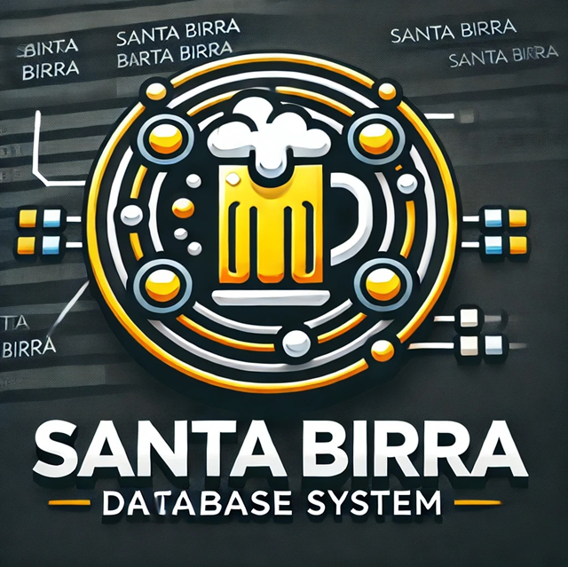

# SantaBirraDB
La base de datos de la discoteca Santa Birra tiene como finalidad centralizar la administración
de clientes, reservas, inventarios, empleados y reportes. Esta herramienta permitirá registrar
información clave, incluyendo datos de contacto, historial de visitas y consumo, detalles sobre
reservas, control de inventarios de productos y seguimiento de pagos y comisiones al
personal. Además, facilitará el análisis de ventas, la efectividad de las promociones y la
gestión de incidentes, asegurando un control eficiente del negocio y mejorando la experiencia
del cliente.

